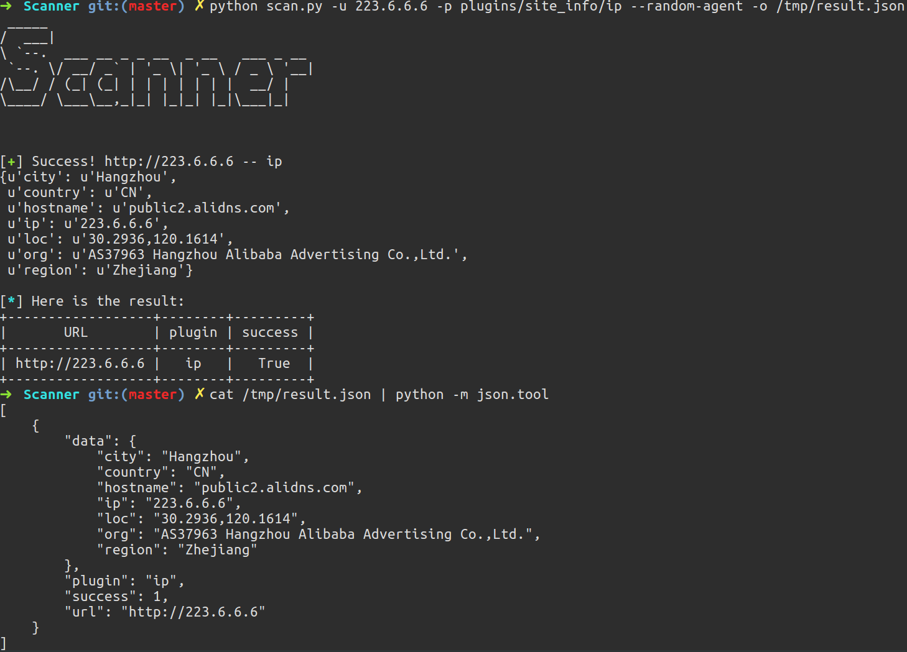

# Scanner 

[](https://www.python.org/)

PoC批量调用框架，可同时调用多个插件对多个目标进行检测。

## Installation

```bash
git clone https://github.com/imp0wd3r/Scanner
pip install -r requirements.txt
```

## Usage

```
➜  Scanner git:(master)  python scan.py -h
 _____                                 
/  ___|                                
\ `--.  ___ __ _ _ __  _ __   ___ _ __ 
 `--. \/ __/ _` | '_ \| '_ \ / _ \ '__|
/\__/ / (_| (_| | | | | | | |  __/ |   
\____/ \___\__,_|_| |_|_| |_|\___|_|   
                                       
                                       

usage: scan.py [-h] (-u URL | -f URL_FILE) (-p PLUGIN | -d PLUGIN_DIRECTORY)
               [--cookies COOKIES] [--user-agent USER_AGENT] [--random-agent]
               [--proxy PROXY] [--threads THREADS] [-o OUTPUT]
               [--extra-params EXTRA_PARAMS]

My vulnerability testing framework.

optional arguments:
  -h, --help            show this help message and exit
  -u URL, --url URL     Target URL
  -f URL_FILE, --file URL_FILE
                        URL file
  -p PLUGIN, --plugin PLUGIN
                        Plugin file
  -d PLUGIN_DIRECTORY, --directory PLUGIN_DIRECTORY
                        Load plugins from a directory

request:
  --cookies COOKIES     HTTP cookies (eg: "{'PHPSESSIONID': 'admin'}")
  --user-agent USER_AGENT
                        HTTP User-Agent header value
  --random-agent        Use randomly selected HTTP User-Agent header value
  --proxy PROXY         Use a proxy to connect to the target URL
  --threads THREADS     Max number of concurrent HTTP(s) requests (default 5)

output:
  -o OUTPUT, --output OUTPUT
                        Save result to a json file

extra_params:
  --extra-params EXTRA_PARAMS
                        Extra params for plugins (eg: "{'user':'xxx',
                        'pass':'xxx'}")

```

## Examples

### 插件示例

```python
from urlparse import urlparse

import redis

from scanner.libs.result import prepare_result


def poc(url, params):
    r = redis.Redis(urlparse(url).netloc, port=6379, socket_connect_timeout=5)
    if r.ping():
        return prepare_result(url, True, {'netloc': urlparse(url).netloc, 'port': 6379})
    else:
        return prepare_result(url, False)

```

编写一个`poc`函数：

- 参数`url`为目标url，如果输入为a.com或http://a.com，则参数`url`的值为http://a.com，如果输入为https://a.com，其值为https://a.com。
- 参数`params`为通过`--extra-params`传入的额外参数。
- 检测结果通过`prepare_result`函数返回，第一个参数为目标url，第二个参数为检测是否成功，第三个参数为检测过程中获取的数据。

调用单个插件对多个目标进行检测：

```bash
python scan.py -f url.txt -p plugins/redis_unauth -o /tmp/result.json
```

**注**：`-p`后的插件名字不要带`.py`后缀

调用多个插件对多个目标进行检测：

```bash
python scan.py -f url.txt -d plugins/site_info -o /tmp/result.json
```

## Screenshot



## Reference

https://github.com/knownsec/Pocsuite

https://github.com/mitsuhiko/pluginbase
